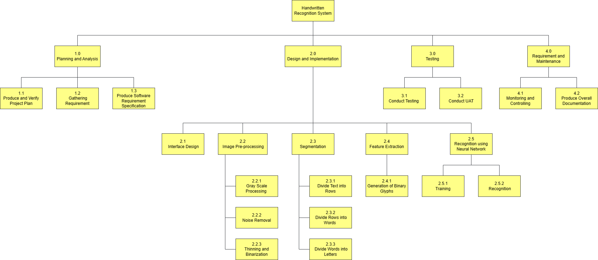

# PROJECT OVERVIEW
## B. PLANNING THE PROJECT

### Project Management Life Cycle:

The project management life cycle is represented and documented in the form of a Gantt chart, which allows us to follow the guidelines and achieve the milestones from time to time. A Gantt chart is a project management tool that assists in planning by showing start and end dates, as well as dependencies, scheduling, and deadlines, including how much of the task is completed per stage and who is the task owner. The project management WBS is shown in the Gantt Chart below:

The WBS stands for Work Breakdown Structure. It is a hierarchical representation of the elements (tasks) that comprise a project. The WBS of our project is shown below:

### Scope

As for the scope, our team has come up with a work breakdown structure (WBS). The WBS consists of all the priamry tasks of the project and has the hierarchical and gradual decomposition of the project into phases, deliverables, and work plans. 

### Risk Chart

Risks in project management are unexpected events that may or may not occur and impact our project outcome in some way and below is the risk chart that shows some risk possibilities that may occur and how to solve it.

| Control Element | Possibilities of Risk | How to identify risk? | Actions to take |
|-----|----|-------|-----|
|Quality/Resources | 1. Illegible handwriting and poor image quality    2. Varied language models | 1. Joined-up handwriting may be challenging for computers to read and certain characters in text may look very similar, which makes it difficult for a computer to recognise accurately.    2. Variety of languages from region to region and the scope of handwriting recognition is limited.| Utilize the Intelligent Character Recognition (ICR) which results low recognition accuracy and  high validation efforts where it allows handwritten characters to be recognised and converted by a computer into computer-readable text.|
|Budget   | Purchasing of optical charcter recognition tool (OCR) might exceed the planned project cost estimation.  | The billing of hardware tools might extra charges. |Lease and subscribe to OCR monthly and pay fixed amount.|
|Timeline   | 1. System not feasible and delivered on time as per planned in Gantt Chart    2. Technical issues in system.  | 1. Shortage of manpower and budget restrictions.    2. Error handling and coding error.| 1. Arrange for double shift and over time by project members.    2.Request for extra expert technical assitance from the technical teams.|

### Responsibility Assignment Matrices (RAM)

 

   
##### Next: [Project Implementation](C-PROJECT_IMPLEMENTATION.md)

