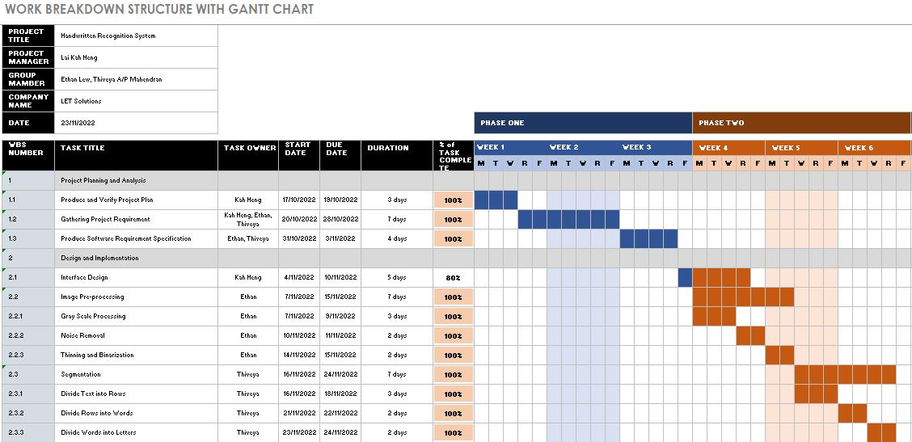

# PROJECT OVERVIEW
## B. PLANNING THE PROJECT

### Project Management Life Cycle:

The project management life cycle is represented and documented in the form of a Gantt chart, which allows us to follow the guidelines and achieve the milestones from time to time. A Gantt chart is a project management tool that assists in planning by showing start and end dates, as well as dependencies, scheduling, and deadlines, including how much of the task is completed per stage and who is the task owner. The project management WBS is shown in the Gantt Chart below:

The WBS stands for Work Breakdown Structure. It is a hierarchical representation of the elements (tasks) that comprise a project. The WBS of our project is shown below:

###Scope

As for the scope, our team has come up with a work breakdown structure (WBS). The WBS consists of all the priamry tasks of the project and has the hierarchical and gradual decomposition of the project into phases, deliverables, and work plans. 

 

   
##### Next: [Project Implementation](C-PROJECT_IMPLEMENTATION.md)

