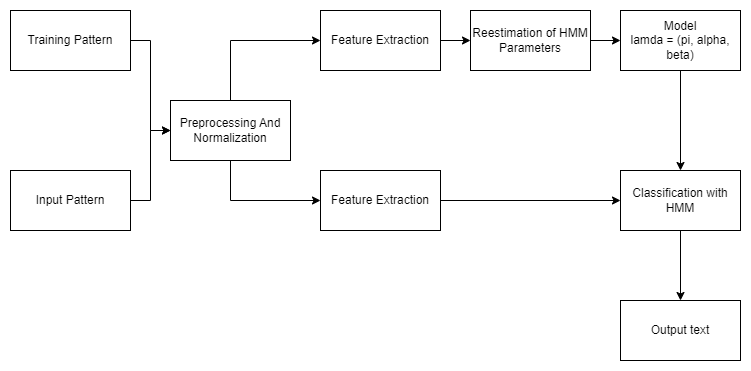
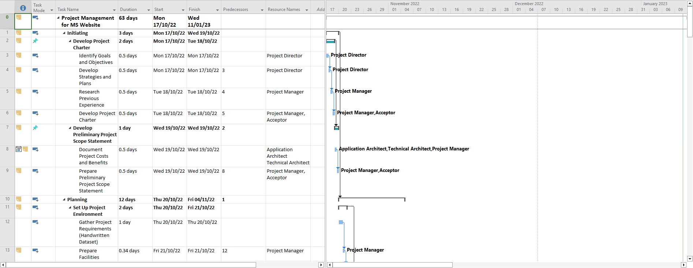
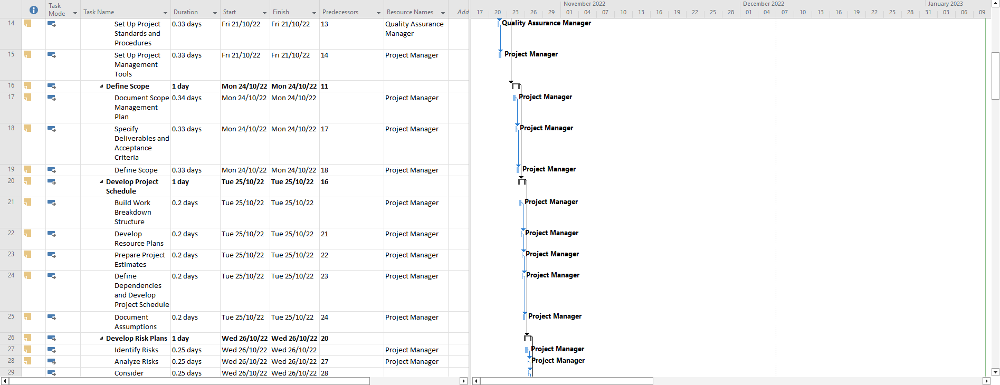
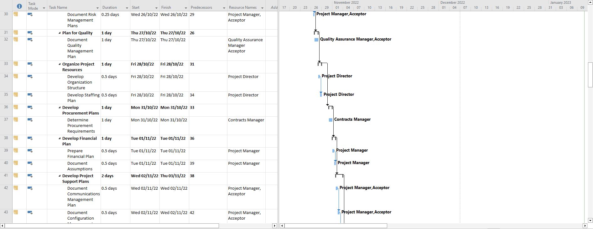
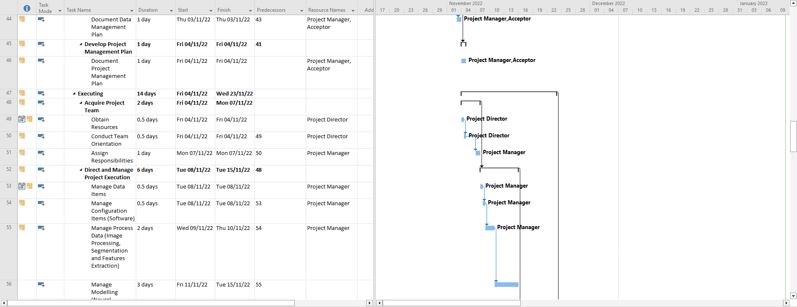
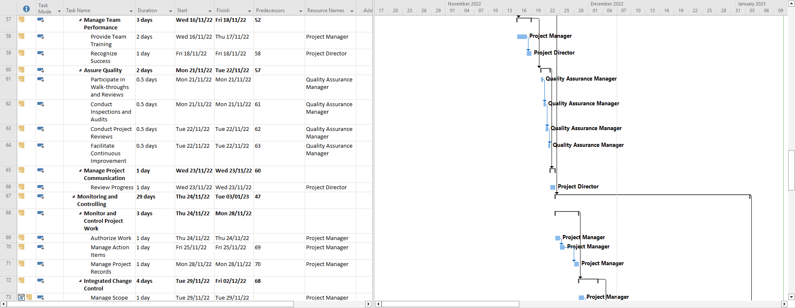
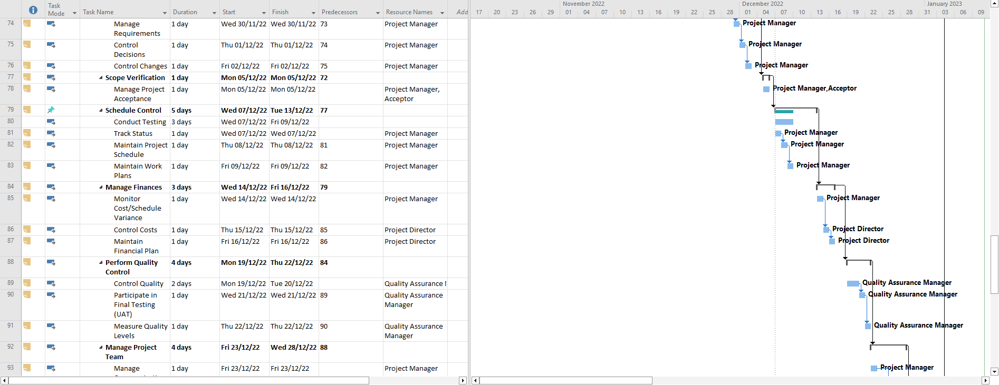
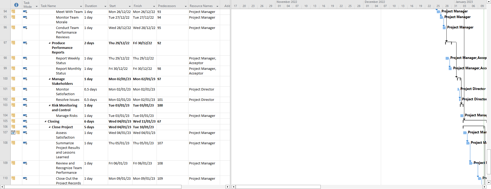
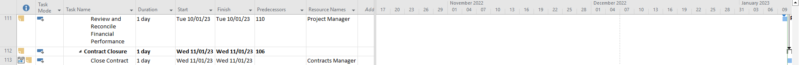

# PROJECT OVERVIEW

## C. IMPLEMENTING THE PROJECT PLAN
### Deliverables:
Hardware Requirement:
For the hardware, our group uses the laptop which consists of intel core i5 and 8GB RAM to conduct our project and android tablets which is Android 10.0 vers above for training our handwriting recognition and run tests on them.

#### Software Requirement:
For the software, We are using OCR (Optical Character Recognition) and IWR (Intelligent Word Recognition) software to receive and interpret intelligible handwritten input from sources such as paper documents, photographs, etc. Using the PHP programming language to design the website and database connection. 

#### Intelligent System Architecture:
The proposed neural network is WPOD-Net, which is a type of convolution neural network.
WPOD-Net architecture:

#### Outcomes of the system
2 main steps will be applied in our system, which is license plate detection and character recognition. Given an input image, the first steps are to detect the license plate using Warped Planar Object Detection Network (WPOOD-Net) and regresses one affine transformation per detection, allowing a rectification of the license plate area to a rectangle resembling a frontal view. These positive and rectified detections are fed to an OCR network for final character recognition. 

### Tasks and Estimated Costs

| Task |  Estimated Costs | Notes |
|-----|----|----|
|   Project Management          |RM169,965                         |  Project manager, team members, and developer engineers      |      
|   Hardware   |RM266,500                         | Handheld devices, servers, AI Stylus pen and touch sensitive screen, and Optical character recognition (OCR) tool| 
|   Software         |RM380,000                        |  Licensed software and Handwritten recognition development                                                 |                              |
|   Testing|RM64,650                           | Hardware and Software testing                                                       |                              |
|   Training and Support              |RM153,500                           |  Trainee cost, Travelling and transportation	, and Project members allowance	|
|   Reserves                      |RM198,923                       |  20% of total estimates     |
|   TOTAL                      |RM1,233,538                        |  Estimated     |

### Milestone Chart
#### Microsoft Project:

   
##### Next: [Project Execution](D-PROJECT_EXECUTION.md)
