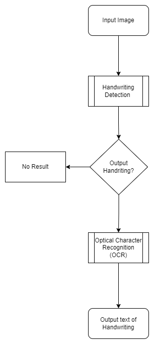

# PROJECT OVERVIEW
## D. EXECUTING THE PROJECT
### Project Design and Coding
Flowchart Design:

Handwriting Recognition Implementation Example

## Description of the project coding implementation

Firstly, we will import some useful libraries. The library needed for handwritten recognition system are numpy and cv2. NumPy aims to provide an array object that is faster and compact than traditional Python lists.  Being an Open-Source library for deep learning and machine learning, TensorFlow plays a vital role in this handwritten recognition system. 

Next is to implement the architecture and structure of convolutional neural network (CNN). CNN has has three layers namely, convolutional, pooling, and a fully connected layer. It is a class of neural networks and processes data having a grid-like topology. The convolution layer is the building block of CNN carrying the main responsibility for computation of the handwritten recognition. 
 

In here we can see that the codes is experimenting by trying different number of layers and nodes where by it uses previous experience to choose the number of layers and nodes. More layers mean more depth, hence deep neural networks will perform better. 

This system uses is a deep Convolutional Recurrent NeuralNetwork (CRNN) inspired from the VGG16 architecture[5] used for image recognition. This is the implementation 
for text-line recognition of documents. We showed how to train such system with few labeled text-line data. Specifically, we proposed to bootstrap an incremental training procedure.

Next is the training phase where to further enhance the performance of the system, we exploited the variability in the writing scale to augment the training set with text-line images at multiple scales. The training lines were first classified into 3 classes (Large, Medium and Small) through Jenks natural breaks optimization algorithm.

Lastly on to the testing phase, the test data were equalized in order to best fit the core model of the system. The combination of the multi-scale trained system results on multi-scale test data has yielded the best results. 

### Project Result

   
##### Next: [Project Closing](D-PROJECT_CLOSING.md)

