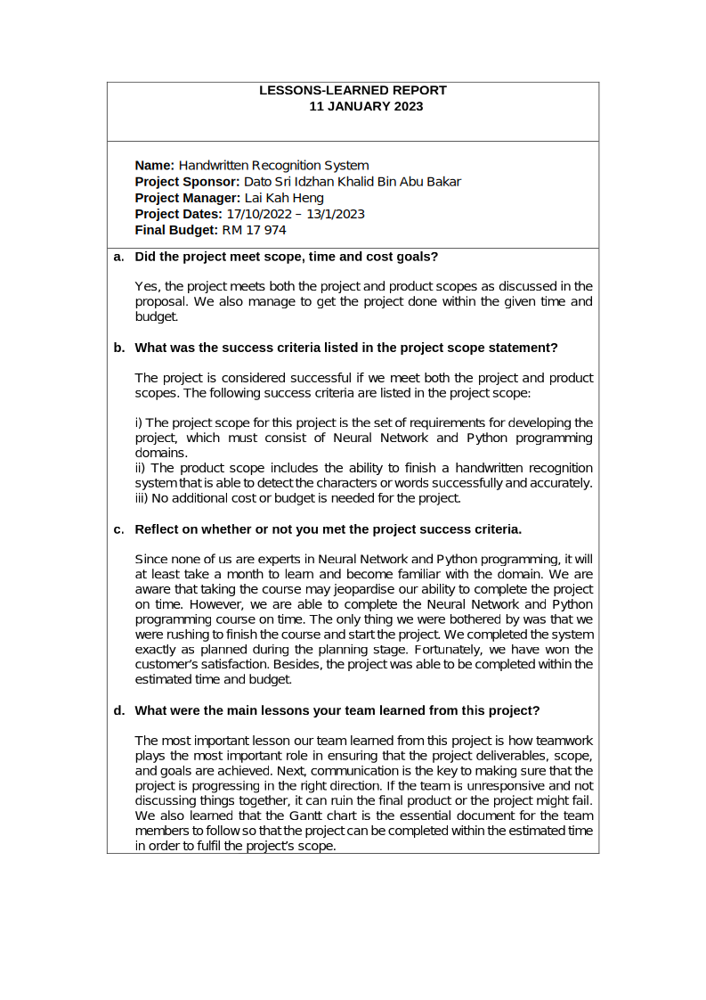

# PROJECT OVERVIEW

## E. COMPLETING THE PROJECT
### Closing Checklist

#### 1. Customer Acceptance Form

#### 2. Lessons Learned Document

#### 3. Final Project Report
**HANDWRITTEN RECOGNITION SYSTEM**
  

**1.0 PROJECT OBJECTIVES**
1. To develop an AI system that is able to recognise human handwriting in English.
2. To construct a tool that takes an image as input and extracts the characters as output.
3. To ensure the system can convert the handwritten images into text data accurately.
 

**2.0 SUMMARY OF THE PROJET RESULTS**

After the handwritten recognition system has been completed, it is able to recognize handwrittings from documents with a high level of accuracy equivalent to 0.96 .

**3.0 ORIGINAL AND ACTUAL SCHEDULE**

The project members stick to the plan as shown in the Gantt Chart, and all progress is on track and fits within the original schedule.

**4.0 ORIGINAL AND ACTUAL BUDGET**

  

**5.0 PROJECT ASSESSMENT**

**5.1 SCOPE**

The project scope was established from the beginning. For instance, the system is not able to detect the handwriting if the handwriting is too blurry and messy. If the image of hanwdriting reflective, and with special fonts also cannot run for the recognition. The system also restricts the project's scope by detecting only alphabetic and numeric characters. Therefore, this system may not be used by countries like China or Thailand, which include Thai and Mandarin.
  

**5.2 OBJECTIVES**

LET Solutions had successfully achieved the objectives that were outlined at the beginning of the project. In this project, Deep Learning is used to identify and read the words or characters on the handwritten image. The developed Artificial Intelligence Handwritten Recognition System can recognise human handwriting in English by taking a handwritten image as input and extracts the characters as output accurately.
  

**5.3 IMPACTS**

By creating this system, it can be used for historical preservation. Historical papers mostly exist in physical format. Examples of historical papers are genealogical information, written manuscripts, old family records, and some personal diaries; sometimes even old past stories are shared. It helps to transform the writings in the papers into a text document format, which can also be said to be a readable electronic format. Historical facts can be saved, reviewed, and easily shared with a large number of people in this manner. From the perspective of teachers and professors, this system can help them identify the fonts of different students, making it easier for them to mark the test papers.
  

**6.0 TRANSITION PLAN**

#### 4. Close Contract

##### Next: [Company Organization](Z-COMPANY_ORGANIZATION.md)
