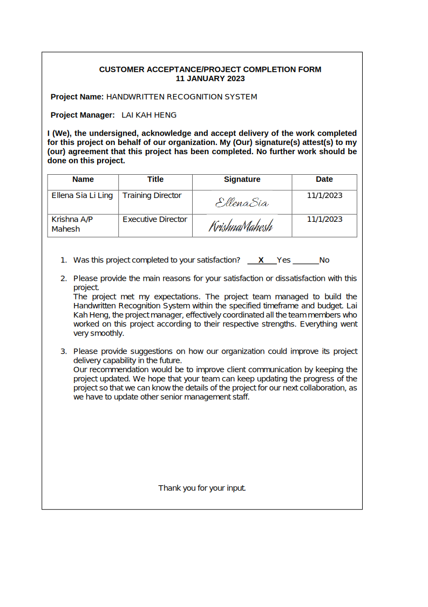
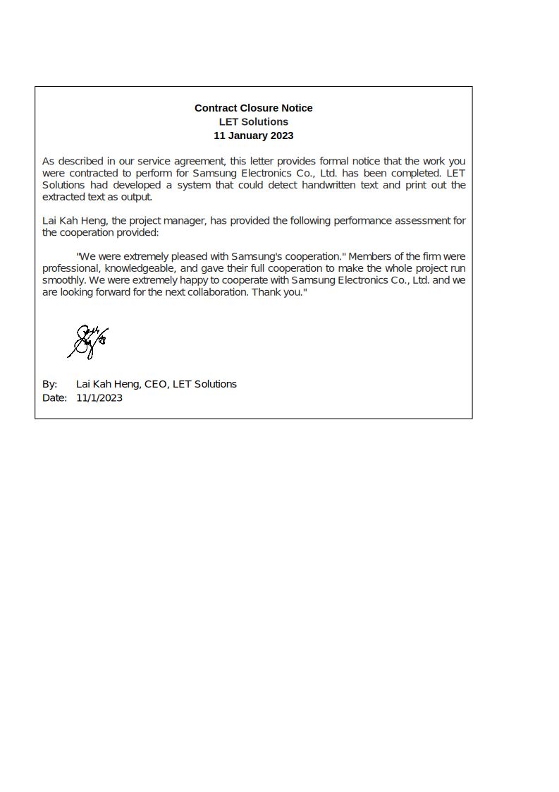

# PROJECT OVERVIEW

## E. COMPLETING THE PROJECT
### Closing Checklist

#### 1. Customer Acceptance Form

#### 2. Lessons Learned Document

#### 3. Final Project Report
**HANDWRITTEN RECOGNITION SYSTEM**
  

**1.0 PROJECT OBJECTIVES**
1. To develop an AI system that is able to recognise human handwriting in English.
2. To construct a tool that takes an image as input and extracts the characters as output.
3. To ensure the system can convert the handwritten images into text data accurately.
 

**2.0 SUMMARY OF PROJECT RESULTS**

  

**3.0 ORIGINAL AND ACTUAL SCHEDULE**

The project members stick to the plan as shown in the Gantt Chart, and all progress is on track and fits within the original schedule.

**4.0 ORIGINAL AND ACTUAL BUDGET**

  

**5.0 PROJECT ASSESSMENT**

**5.1 SCOPE**

  

**5.2 OBJECTIVES**

LET Solutions had successfully achieved the objectives that were outlined at the beginning of the project. In this project, Deep Learning is used to identify and read the words or characters on the handwritten image. The developed Artificial Intelligence Handwritten Recognition System can recognise human handwriting in English by taking a handwritten image as input and extracts the characters as output accurately.
  

**5.3 IMPACTS**

  

**6.0 TRANSITION PLAN**

#### 4. Close Contract

##### Next: [Company Organiation](PMP-PLAN/Z-COMPANY_ORGANIZATION.md)
